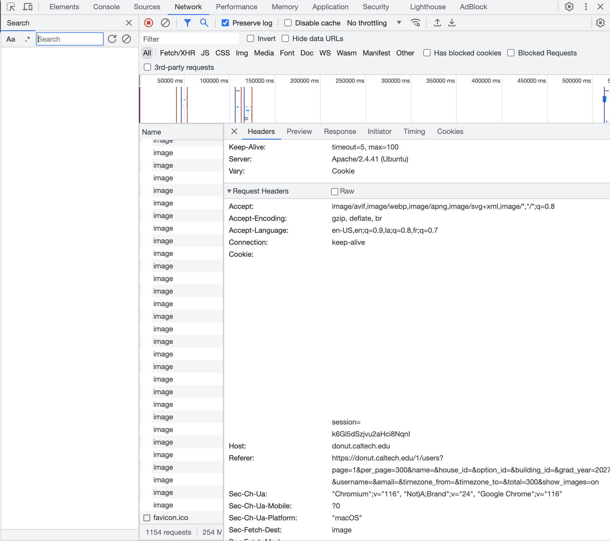

# Donut Theft

Admin sometimes doesnt provide prefrosh images, so we gotta scrape

## running this script

run the following from the root of this project:

```
npm run python-config
npm run scrape
```

`python-config` configures the python venv, which you might need to do manually on your own system. (this was made for linux/mac) It also assumes you have the venv package already installed `pip install venv`.

`scrape` runs the scraping script

- downloads all the prefrosh images into the public/images directory of frotator.
- generates src/script/temp/scrape.csv which can be uploaded to the adminpanel to update the frosh info

## Details:

It turns out that when you look at the donut directory you can request as many results on one page as you like, its not hard coded, so you can write a query like this:

```
https://donut.caltech.edu/1/users?page=1&per_page=300&name=&house_id=&option_id=&building_id=&grad_year=2027&username=&email=&timezone_from=&timezone_to=&total=278&show_images=on
```

Note:

```
per_page=300
total=300
grad_year=[prefrosh year]
show_images=on
```

where total & per page are some number greater than the number of frosh

Making this request will give all of the frosh pics on one page.

## Actually making requests

Since you have to be logged in for donut you can't just make a get request to scrape the page, you have to appear logged in.

This can be done by looking at your request headers when you access the page normally and finding the session cookie:



I've blacked out my cookies, but `session=[key]` is the important section. Just grab that and give it to the script when prompted (just the key after the equals sign).

## Finally

You need to create the spreadsheet. The template is .